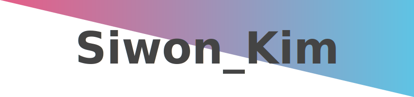

<!--
**kimww42/kimww42** is a ✨ _special_ ✨ repository because its `README.md` (this file) appears on your GitHub profile.

Here are some ideas to get you started:

- 🔭 I’m currently working on ...
- 🌱 I’m currently learning ...
- 👯 I’m looking to collaborate on ...
- 🤔 I’m looking for help with ...
- 💬 Ask me about ...
- 📫 How to reach me: ...
- 😄 Pronouns: ...
- ⚡ Fun fact: ...
-->

  

<table>
    <thead>
        <tr>
            <th>CV</th>
            <th>Workplace</th>
            <th>Period</th>
          <th>+α</th>
        </tr>
    </thead>
    <tbody>
        <tr>
            <td rowspan=2>Education</td>
            <td>아주대학교 소프트웨어학과</td>
            <td>March 2019 ~</td>
          <td></td>
        </tr>
        <tr>
            <td>아주대학교 의료인공지능 마이크로전공</td>
            <td>March 2023 ~</td>
          <td></td>
        </tr>
        <tr>
            <td rowspan=2>Worked</td>
            <td>ROKA 11div</td>
            <td>September 2020 ~ March 2022</td>
          <td>CERT</td>
        </tr>
      <tr>
            <td>Insilicogen Internship</td>
            <td>January 2023 ~ February 2023</td>
          <td>BioInformatics / ML</td>
        </tr>
        <tr>
            <td rowspan=3>Experience</td>
            <td>2018 KOI 전국본선 참가</td>
          <td>July 2018</td>
          <td></td>
        </tr>
        <tr>
            <td>2018 KOI 부산대회 참가</td>
          <td>May 2018</td>
          <td>장려상</td>
        </tr>
      <tr>
            <td>2017 KOI 부산대회 참가</td>
          <td>May 2017</td>
          <td>장려상</td>
        </tr>
    </tbody>
</table>

</a>
</a> 
</a>
</a>
</a>
</a>
</a> 
</a>
</a>
</a>
</a>

